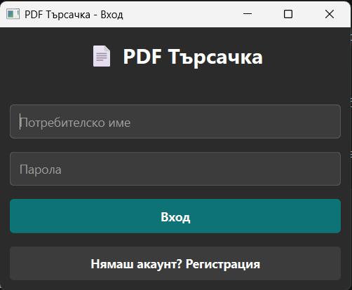
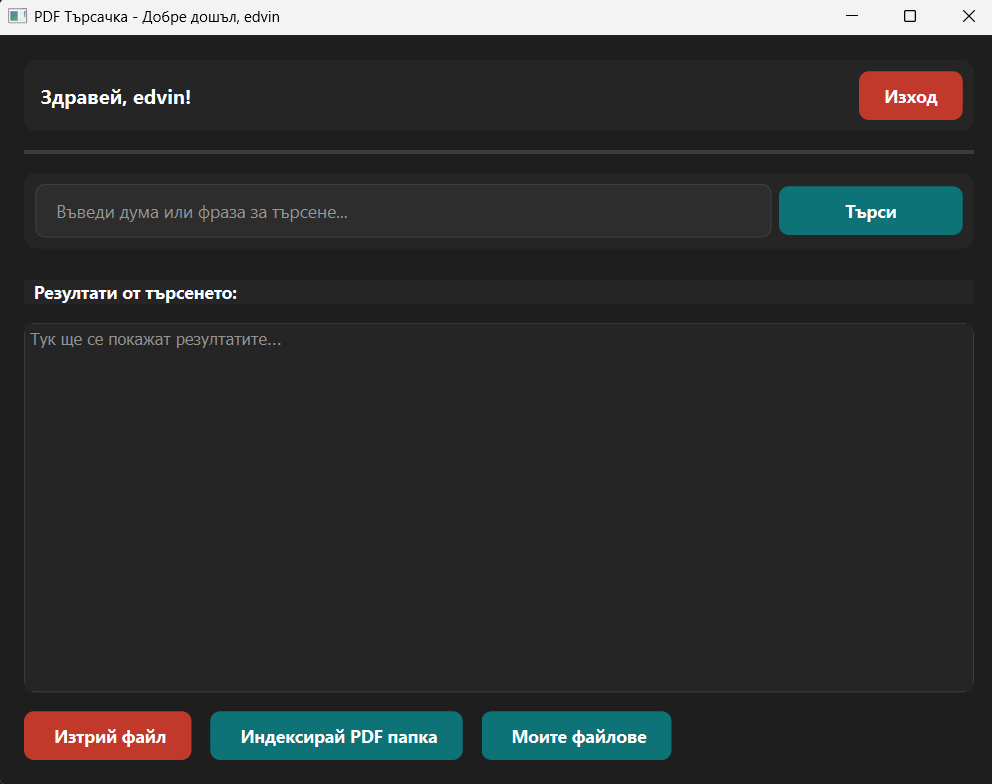

# PDF Търсачка

Това е десктоп приложение за индексиране и търсене на думи в PDF файлове.  
С него можеш да регистрираш потребител, да добавяш папки с PDF файлове и да търсиш точни думи или части от думи в тях.

### Screenshot




### Technologies Used

- Python 3
- PyQt6 – графичен интерфейс
- PyMuPDF (fitz) – извличане на текст от PDF
- bcrypt – хеширане на пароли
- SQLite – локална база данни
- Регулярни изрази (re)

### Installation

1. **Клонирай хранилището** (или разархивирай файловете)

2. **Създай виртуална среда** (препоръчително)
```bash
python -m venv venv
source venv/bin/activate # за Linux/Mac
venv\Scripts\activate # за Windows
```

3. **Инсталирай зависимостите**
```bash
pip install -r requirements.txt
```

4. **Стартирай приложението**
```bash
python main.py
```


### Как се ползва

1. **Регистрация** – Създай нов акаунт (потребителско име и парола с минимум 4 символа).

2. **Вход** – Влез със своите данни.

3. **Индексирай папка** – Натисни бутона **"Индексирай PDF папка"** и избери папка с PDF файлове (включително подпапки). Приложението ще обработи всички PDF файлове и ще запише всяка уникална дума заедно с номера на страницата.

4. **Търсене** – Въведи дума или част от дума в полето за търсене и натисни **"Търси"**. Ще видиш списък с файловете и страниците, на които се среща терминът.

5. **Моите файлове** – Този бутон показва всички индексирани от теб PDF файлове.

6. **Изтрий файл** – С този бутон можеш да премахнеш даден файл от индекса (самият файл не се изтрива от диска).

### Забележки

- Индексират се само думи с дължина между 3 и 50 символа.
- Търсенето не прави разлика между главни и малки букви.
- Всички данни се съхраняват локално в SQLite база данни (`pdf_search.db`).
- При повторно индексиране на папка старият индекс за потребителя се изтрива напълно и се създава нов.
- Ако няма резултати, приложението дава съвети – провери дали си индексирал файлове и дали думата е написана правилно.
